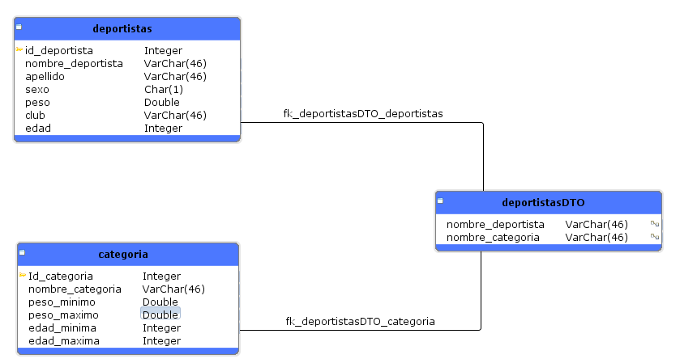
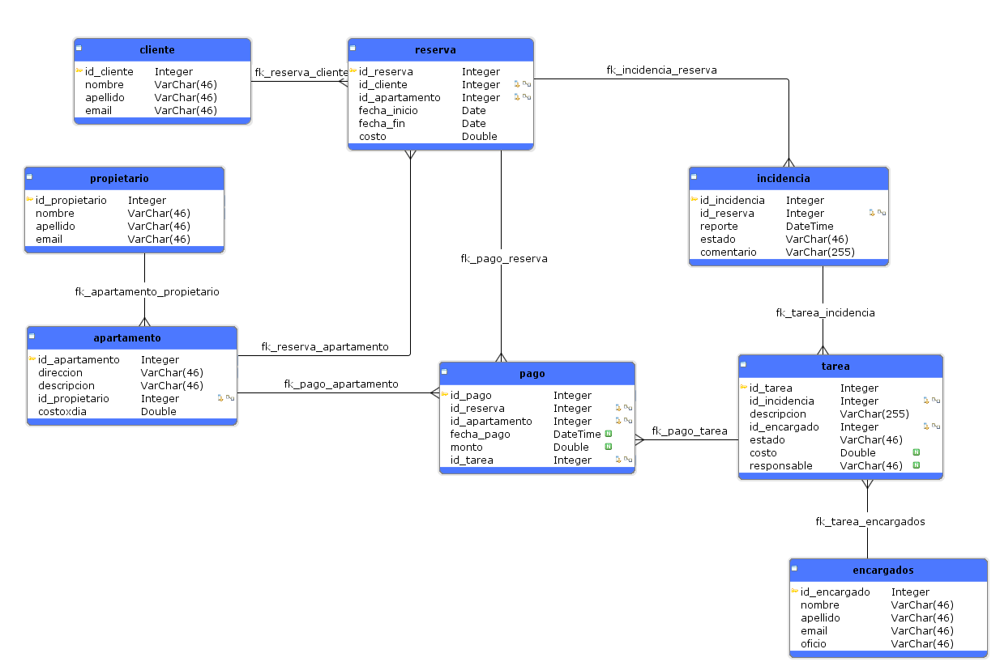

# 1. ¿Para qué sirve la función explode?.

Esta funcion en PHP sirve para separar una cadena en partes devolviendo un 
array de string donde cada valor es un substring de la cadena original

Esta separacion se puede hacer indicando el delimitador en el parametro 
a utilizar (, - _)

explode($delimitador, $cadena);

Un ejemplo del uso que se le puede dar podria ser este 

$cadene_original = "arroz, carne, pollo";
$delimitador = ",";
$cadena_explode = explode($delimitador, $cadena);

Si queremos revisar los substring de la cadena solo es buscarlo por su 
posicion en el index 

echo $cadena_explode[1] seria "carne"

# 2. ¿Qué diferencias hay entre POST, PUT, DELETE?

Todos estos son parte de los metodos HTTP que se usan para interactuar 
con servidores, la diferencia radica en el proposito de cada uno ya que
son usados para cosas distintos

- POST: Principalmente se utiliza para enviar datos al servidor 
generalmente para crear un nuevo recurso, como creando un nuevo usuario 
a traves de un formulario. 

- PUT: El metodo PUT es usado para actualizar una informacion ya existente,
esta nueva informacion es enviada al servidor y se actualiazara el recurso,
como puede ser actualizar un numero de telefono de un cliente registrado

- DELETE: Este metodo se usa cuando se necesita borrar un recurso del servidor,
como eliminar un cliente de la base de datos. 

# 3. ¿Qué es un DTO? de un ejemplo de cómo usarlo

DTO acronimo de Data Transfer Object un DTO es un objeto plano pero que es 
usado para que es usado para manejar la informacion entre capa de servicios
en una aplicacion, el DTO se crea con unos atributos que pueden ser enviados 
o pedidos por el servidor en una solo llamado, una forma de utilizar el 
patron DTO es creando un objeto plano que contenga los atributos de dos o mas tablas
omitiendo datos innecesarios al momentar de ser llamado

Ejemplo: 

Tenemos la tabla deportista con diferentes atributos nombre, peso, edad, sexo etc..
y la tabla categorias con los atributos nombre, edad, peso minimo, peso maximo
En este caso podemos crear un DTO que solo contenga nombre del deportista y nombre de la categoria al momento de llamar este objeto plano tendremos el nombre del deportista y el nombre de su categoria sin demas datos innecesarios

# 4. ¿Para qué sirve el siguiente código?: if (empy($variable)){}
#nota: empty 
En la linea de codigo esta utilizando la funcion empty para evaluar
una variable, esta funcion empty() evalua una variable y duelve un valor despues
de revisar la variable, en caso de que sea null, "", 0, un array vacio, booleano 
false o no estar definida el valor sera true, en caso contrario false. 

Esto puede ser usado para realizar validaciones, como que no colocar una edad 
menor o igual a 0, verificar si la variable si contenga informacion o validar
un formulario. 

En el caso preciso del codigo if (empty($variable)){}, se entiende que si 
#$variable despues de ser evaluada por empty devuelve true proceda a hacer una
instruccion por especificar. 

# 5. Funcion en PHP para formatear el codigo postal 

 function formatoCodigoPostal($codigoPostal) {
    
    $codigoPostal = str_replace(' ', '', $codigoPostal); 

    if (strlen($codigoPostal) < 5) {
        $codigoPostal = str_pad($codigoPostal, 5, '0', STR_PAD_LEFT);
    }

    return $codigoPostal;
 }

En la siguiente funcion llamada formatoCodigoPostal se realiza lo pedido, lo primero
es recibir el codigo postal este seria la variable $codigoPostal, se usa 
la funcion str_replace para reemplazar todas los espacios con una cadena
vacia, se valida si $codigoPostal es inferior a 5 en caso que sea asi 
entonces se utiliza str_pad para colocar 0 al inicio de $codigoPostal hasta
que llegue a 5 de longitud para al final retornar $codigoPostal

# 6. Solucion carga del servidor entre 2 am y 3 pm 

En este caso para solucionarlo habria que implementar una solucion inmediata que 
solucionara temporalmente el problema, esto seria algo asi como un Hot fix, no 
esta pensado para quedarse ni es parmenante, el cual seria no aceptar transacciones
en horas de la madrugada, asi evitariamos perder la trazabilidad de estas transacciones,
esto como Hot fix para poder implementar una solucion definitiva.

Dado que el problema radica en la carga del servidor se me ocurre implementar una programacion
de tareas, donde las tareas en las horas pico no se procesen inmediatamente sino que sean 
almacenadas de manera temporal para ser procesadas durante horarios con menor carga, de esta
manera tenemos una solucion facil de implementar y que aprovecha los recursos
en horarios de baja carga.
Otra solucion aunque algo mas compleja y costosa seria usar servicios de terceros
como AWS para implementar una cola de mensajes que sean procesados de manera
asincrona, la logica seria la misma pero esto seria externo a la base de datos
que ya se posee. 

# 7. Modelo entidad relacion para el caso de prueba 

Este es el modelo solucion al caso planteado, cuenta con las tablas para los datos requeridos como cliente, apartamento, reserva, propietario y para la generacion de las incidencias asi como las tareas y su costo, el pago solo se genera si el responsable es el propietario. 